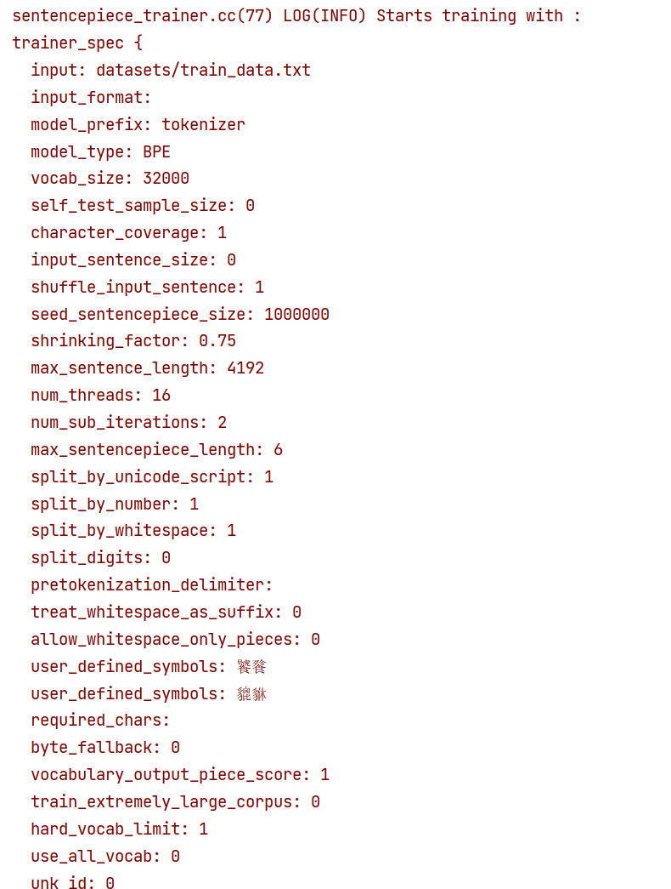
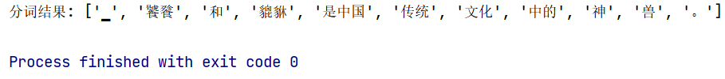

# 使用Sentencepiece对中文语料进行分词

如果您想参考博客，请阅读 [CSDN 📄](https://blog.csdn.net/weixin_43515780/article/details/134700346?spm=1001.2014.3001.5502)。


## Part1 什么是分词（Tokenization）？为什么要进行分词？基于word和char粒度分词有什么缺点？

问题一：分词就是将连续的文本分割成一个个独立的词元（token），分词的方法基于三个粒度分别是，word、char、subword。
问题二：计算机无法直接识别我们的文字，需要将文字转换为计算机可以识别的字符。
问题三：
（1）基于word粒度会导致词表（vocab）过大，进而致使训练冗余，主要是因为每个单词的衍生词过多，比如look，looking，looks等等。
（2）最重要的是会导致OOV问题（out of vocabulary）即未出现在词表当中的词将无法处理。
（3）低频词/稀疏词无法在训练当中得到充分的学习，模型无法充分理解这些词的语义。
（4）基于char会导致词表过小，无法充分理解语义信息。

## Part2 BPE（Byte Pair Encoding）是什么，如何实现？有什么优势和缺点？

问题一：BPE是字节对编码，是一种数据压缩的方法。可以将文本分解为子词或字符级别的单位。
BPE分词过程：
（1）收集训练语料，并确定词表的大小（比如ChatGLM-2是64794，Baichuan-2是125696）。
（2）确定最大的合并单元（在这个单元内合并子词形成新的子词，新的子词的长度不超过设定单元的大小），比如一个英文单词或者6个中文单词内，注意这里对于英文是以字母和字符作为初始词表，而对于中文是以字节作为基本词表（一个汉字由三个字节组成），这主要是因为中文没有天然的空格分隔符，但是sentencepiece中空格被作为一个特殊的字符。
（3）在语料上统计单元内相邻子词组成新子词的频数，选取频数最高的新子词添加到词表当中。
（4）重复（3）直到达到词表的设置大小或者下一个新子词的概率为1。
编码过程：将文字用子词替代，具体来说在词表中从最长的子词查询到最短的子词。 如果仍然有文字没被替换但查询完毕，则将剩余的子词替换为特殊token，如<unk>。
问题二：
优势：能够解决OOV和低频词无法充分训练的问题并减小词表的大小。
缺点：如果语料过小，则分词效果不佳。

## Part3 BBPE（Byte-level BPE）是什么？他跟BPE有什么区别？

问题一：BBPE是基于字节水平的BPE。可以将文本分解为字节级别的子词。
问题二：相比于BPE，BBPE选择UTF-8编码的字节作为初始词表，这种方式更适合于中文的分词，因为中文缺少天然的空格分隔符。同时，我们需要设置最大的分词长度，在这个最大的分词长度内合并频数最高的子词对。

## Part4 WordPiece跟BPE有什么区别？
Wordpiece与BPE的步骤（1），（2），（4）相同，不同点在于选择新子词的规则。WordPiece的规则是，选择在语料上单元内相邻子词组成的最大程度提高训练数据似然值（3-5 gram得分）的新子词添加到词表当中。

## Part5 利用Sentencepiece库创建中文词表

### 1. 语料预处理
这里将《明朝那些事儿》作为训练语料，由于在Sentencepiece中会将空格作为一个特殊的字符，增大了语料的规模，导致训练冗余，所以首先对语料中无效的空格进行删除。
```bash
sentences = []
with open("datasets/明朝那些事儿.txt",encoding="ansi") as file:   #加载文档
    data = file.read().split("\n")
for row in data:        #删除无用字符
    row = row.strip()
    sentences.append(row)
# print(sentence)
with open("datasets/train_data.txt", "w", encoding="utf-8") as file:
    file.write("\n".join(sentences))
```
### 2. 进行训练
对于训练，我们需要关注参数的设定，比如model_type， vocab_size，user_defined_symbols， max_sentencepiece_length，他们分别代表分词的方法，词表大小，特定token，最大的基本单元。
```bash
import sentencepiece as spm
spm.SentencePieceTrainer.train(
    input='datasets/train_data.txt',
    model_type="bpe",
    model_prefix='tokenizer',   #输出模型名称前缀。训练完成后将生成 <model_name>.model 和 <model_name>.vocab 文件。
    vocab_size=32000,       #目标词表的大小
    user_defined_symbols=['饕餮', '貔貅'],#可以设置自己特定的token，并且这个token不会被拆成子词
    character_coverage=1,  #覆盖字符的比例
    max_sentencepiece_length=6  #最大的基本单元,也就是在这个单元内的词进行合并
)
```


### 3. 进行测试
```bash
import sentencepiece as spm

# 加载训练好的模型
model_path = "tokenizer.model"
tokenizer = spm.SentencePieceProcessor()
tokenizer.load(model_path)

# 测试分词器
text = "饕餮和貔貅是中国传统文化中的神兽。"
tokens = tokenizer.encode_as_pieces(text)

print("分词结果:", tokens)
```


### 完结！以上内容是个人的理解总结，如果有错误，请您及时指正，期待与大家一起交流成长！